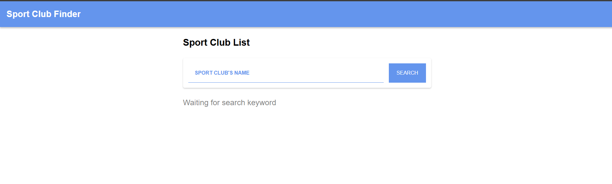
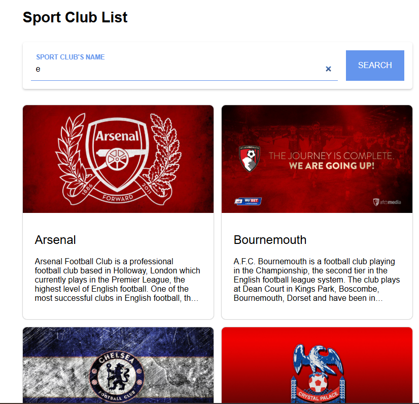

# 🏆 Club Finder App

Club Finder App is a web-based application designed to help sports enthusiasts find their favorite football clubs. This project demonstrates the implementation of Vanilla JavaScript Web Components and Webpack as a module bundler to create a modular and high-performance front-end application.
# 🚀 Key Features

    Custom Web Components: Built using modular components such as <app-bar>, <search-bar>, <club-list>, and <footer-bar> for better maintainability.

    Real-time Search: Search for football clubs from a local data source with instant feedback.

    Interactive States: Includes "Waiting for input" and "Loading" states to improve user experience.

    Responsive Design: Fully optimized for various screen sizes using modern CSS.

    Optimized Build: Bundled with Webpack for both development and production environments.

# 📸 Preview

## Main Dashboard

Initial state of the app waiting for user interaction.
## Search Result

Displaying football club details like Arsenal, Chelsea, and more.

# 📁 Project Structure
```
.
├── src/

│   ├── public/             # Static assets (favicon, etc.)

│   ├── script/             

│   │   ├── components/     # Custom Web Components (UI)

│   │   ├── data/local/     # Local data source (clubs.js)

│   │   ├── view/           # View logic (home.js)

│   │   └── utils.js        # Helper functions

│   ├── styles/             # CSS stylesheets

│   └── app.js              # Main entry point

├── index.html              # Main HTML template

├── webpack.common.js       # Base Webpack configuration

├── webpack.dev.js          # Development configuration

├── webpack.prod.js         # Production configuration

└── package.json            # Project dependencies and scripts
```
# 🛠️ Tech Stack

    JavaScript (ES6+): Core logic and Web Components.

    Webpack: Module bundling and development server.

    CSS3: Styling and layout.

    NPM: Package management.

# ⚙️ Getting Started
1. Prerequisites

Make sure you have Node.js and npm installed on your machine.

2. Installation

Clone the repository and install dependencies:
Bash

npm install

3. Production Build

Generate an optimized production build in the dist/ folder:
Bash

npm run build

4. Development Mode

Run the application locally with Webpack Dev Server:
Bash

npm webpack serve --config webpack.dev.js

Open http://localhost:8080 in your browser.


# 👤 Author

Developed by ranggautama47 as part of the Dicoding Indonesia Front-End Web Development Fundamental curriculum.
